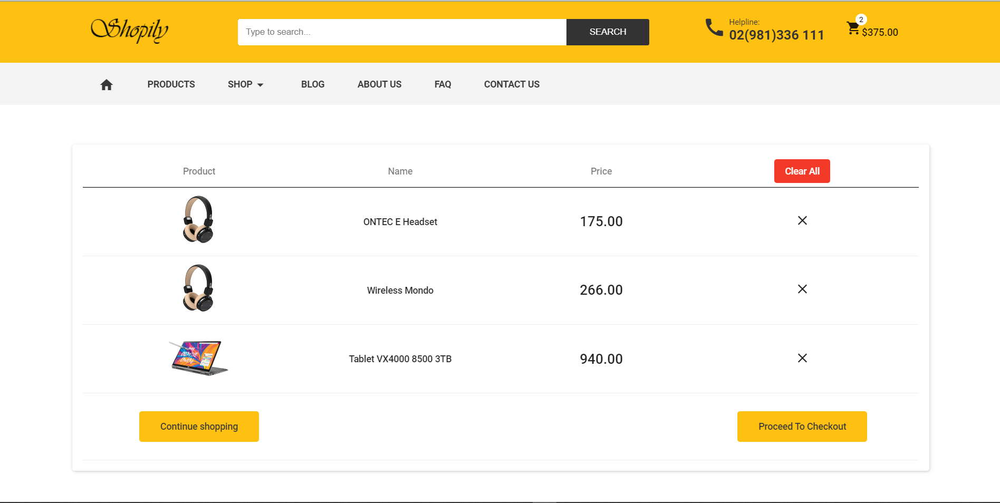

  WORK IN PROGRESS  :construction:  80%

# EcomStore

This project was generated with [Angular CLI](https://github.com/angular/angular-cli) and ASP.NET WebAPI 

### What's included:

- Angular 8 & Typescript :heart:
- Bootstrap 4+ & SCSS
- Responsive layout
- High resolution
- Easy to customize :wrench:
- User Authentication using email & password
- Add Items To Cart
- Compare System (You can compare two to three items before you bought them)
- You can Add items to wishlist 
- Filters System by Tags, Brand, Price etc

# Features
- Searching and autocomplete with Elasticsearch
- Chat Bot 
- Admin dashboard

## Installation

1. Clone This Repo with the following link `https://github.com/ismailraqi/EcomSolution-Front-End`
2. inside project open new terminale and run the following line  `npm install`
3. in the same terminale run `ng serve -o` . NB : The app will automatically reload if you change any of the source files.
3. It's finish enjoy !

## Preview

